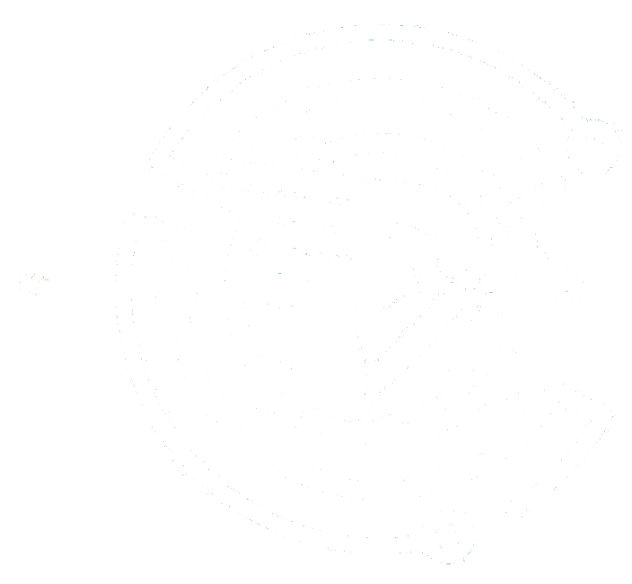
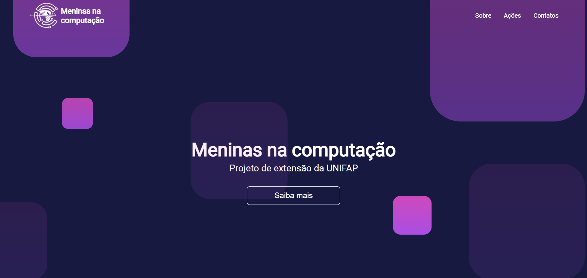

<p align="center" style="margin-top: 50px">
  </img>
</p>

<p align="center" style="margin: 50px">
  <a href="https://github.com/Lorenalgm/meninasnacomputacao">
    </img>
  </a>
  <a href="https://github.com/Lorenalgm/meninasnacomputacao/blob/master/LICENSE.md">
    </img>
  </a>
  <a href="https://github.com/Lorenalgm/meninasnacomputacao">
    </img>
  </a>
</p>

# Índice

* [Sobre o projeto](#meninas-na-computacao)
  * [Feito com](#feito-com)
  * [Objetivo](#objetivo)
  * [Justificativa](#justificativa)
* [Iniciando](#iniciando)
  * [Instalação](#instalação)
* [Contribuindo](#contribuindo)
* [Autora](#autora)
* [Licença](#licença)

## Meninas na computação
> O Meninas Na Computação é um projeto de extensão da Universidade Federal do Amapá (UNIFAP).

<p align="center">
    </img>
</p>

## Feito com
* [HTML](#https://www.w3schools.com/html/)
* [CSS](#https://www.w3schools.com/css/)

## Objetivo

Queremos descomplicar e desmistificar a computação levando o aprendizado da área à meninas do ensino básico, mostrando que tecnologia é, sim, coisa de menina.

## Justificativa

Nosso projeto surgiu com a inquietude em relação ao baixo interesse e permanência de mulheres nos cursos de computação.

## Iniciando

Para iniciar, veja o processo de instalação.

## Instalação

Clone o repositório:

```git
git clone https://github.com/Lorenalgm/meninasnacomputacao
```

Abra o index.html no seu navegador preferido :)

## Autora

Foto | Nome | GitHub | Likedin | E-mail
---- | ---- | ------ | ------- | ------
 | Lorena GM | [Lorenalgm](https://github.com/Lorenalgm) | [Linkedin](http://linkedin.com/in/lorenagmontes/) | lorena@proesc.com

## Contribuindo

Confira a página [CONTRIBUTING](./CONTRIBUTING.md) para ver os melhores locais para arquivar problemas, iniciar discussões e começar a contribuir.

## Licença

Lançado em 2020.
Este projeto está sob a [Licença MIT](./LICENSE.md).

---

<p align="center">
    Feito com :heart: por <a href="https://github.com/Lorenalgm">Lorena</a>
</p>
